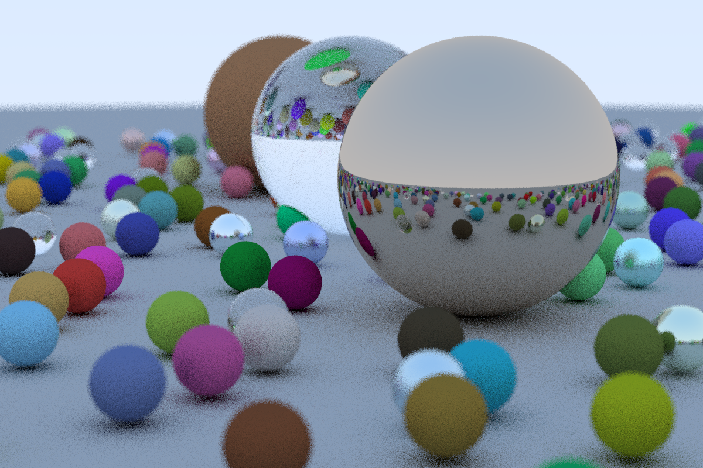

# RayTracingInOneWeek
Peter Shirley의 레이트레이싱 무작정 따라하기
  
Reference : [Ray Tracing in One Weekend](https://raytracing.github.io/)  
책을 보고 구현을 따라해보는 프로젝트입니다.
코드만 베껴적으면 주말 이틀은커녕 반나절에도 할 수 있겠지만 책의 내용을 평소 그래픽스 관련 지식과 결합해서 공부해볼 생각에 천천히 진행했습니다.

성능 등 추가 이슈를 크게 신경쓰지 않고 object는 sphere만 이용한 프로젝트라 구현 자체는 간단하지만  
반사, 굴절, 산개 등 물리학 지식을 더 필요로 하는 프로젝트였던 것 같습니다.

추가해볼만한 것: 멀티스레딩, Triangle 추가, Texture loading, 책 2권,3권 하기

Result :  각 pixel마다 sample 10개
  
